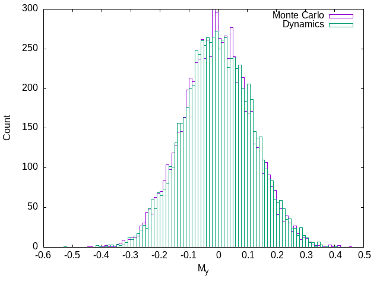

# Classical spin chain simulation

Linux binary [available](https://github.com/tveness/spinchain/releases)


## How to build the rust project

1. Clone the repository `git clone https://github.com/tveness/spinchain.git`
2. Ensure the rust toolchain is installed, see https://rustup.rs/
3. Run `cargo build --release` to compile a fast version of the code, it may
   take a couple of minutes
4. The binary is now located at target/release/sc
5. `sc --help` will product the help dialogue listed below
6. `sc` will run a simple chain, and write the default configuration to `config.toml`


Classical spin-chain simulation for project investigating periodic driving of a
spin chain coupled to a bath.

Numerically simulates the time-evolution of the classical spin-chain given by
$$
H = - \sum_j  {\bf S_j} J_j {\bf S_{j+1}} + \sum_j {\bf B_j} \cdot {\bf S_j}
$$
where $J={\rm diag}(1,1,\lambda)$ plus noise on the diagonal drawn from a
normal distribution, and the local magnetic field is a static field plus noise
drawn from a separate normal distribution.

## Usage (output of `sc --help`)
```
sc 0.1.32
Thomas Veness <thomas.veness@nottingham.ac.uk>
Run classical spin chain simulation

USAGE:
    sc [OPTIONS]

OPTIONS:
    -a, --avg
            Calculate average of runs

    -A, --adiabatic <TAU>
            Find adiabatic ensemble H-\\omega S^z

    -b, --beta <BETA>
            Override config beta

        --config-desc
            Print description of config file

    -d, --dynamic-histogram [<POINTS>]
            Generate time-evolution histogram (hist_dyn.dat) (default POINTS=1000)

    -D, --adiab_full <TAU>
            Find adiabatic ensemble H-\\omega S^z inhomogeneous

    -e, --ext
            Produce profile of energy density as a function of t

    -E, --magnus-fit <E>
            Fit temperature of Monte-Carlo ensemble with energy density E in lab frame, leading
            Magnus

    -f <E>
            Fit temperature of Monte Carlo ensemble with energy density E

    -F <E>
            Calculate effective ensemble temperature via conserved quantity arguments

    -h, --histogram [<POINTS>]
            Generate histograms via Monte-Carlo (hist_mc.dat) and via time-evolution (hist_dyn.dat)
            (default POINTS=8000)

    -H, --high-freq <E>
            Calculate effective ensemble with initial temp and first-order Magnus

        --help
            Print help information

    -l, --langevin [<GAMMA>]
            Directly simulate Langevin dynamics on the system proper (default GAMMA=1.0)

    -m, --monte-carlo
            Calculate an average quantitiy in Monte-Carlo

    -m, --monte-carlo-magnus
            Calculate an average quantitity in Monte-Carlo, Magnus expansion to second order in
            omega^{-1}

        --magnus-hist [<POINTS>]
            Generate histogram via Monte-Carlo (hist_mc_magnus.dat) for first-order Magnus
            expansion, and print averages (default POINTS=8000)

    -n, --n-steps <TAU1,TAU2,...>
            Generate single-shot time-evolution at different drive periods tau

    -p, --monte-carlo-profile
            Calculate an average quantitiy in Monte-Carlo, spatially resolved

    -P, --dynamic-profile
            Calculate an average quantitity in dynamical runs, spatially resolved

    -r, --rot-frame <E>
            Fit temperature of Monte-Carlo ensemble with energy density E in rotating frame

    -s, --trajectory [<POINTS>]
            Generate time-evolution histogram (hist_sj.dat) (default POINTS=1000)

        --steps <STEPS>
            

    -t, --tau <TAU>
            Override tau from config

    -V, --version
            Print version information
```


# Configuration features

In config.toml (if not present, default will be generated when running), there
are the following parameters  (obtains by running `sc --config-desc`)
```
# Default config and description of options
hsize = 512    # size of the system
ssize = 8      # size of subsystem (driven part)
t = 256        # final time of simulation
dt = 0.02      # time-step for simulation
runs = 2       # number runs to perform
threads = 2    # number of parallel threads
trel = 0       # minus initial time
tau = 10       # period of drive
lambda = 1     # value of J_z coupling
hfield = [0.0, 0.0, 0.0] # constant h field on entire system
hs = [0.0, 0.0, 0.0]     # constant h field on subsystem
jvar = 0.001   # variance in J couplings (x, y, z independent)
hvar = 0       # variance in field
method = 2     # method for numerical integration (2=2nd order Suzuki-Trotter)
ednsty = -0.66 # energy-density of initial state
file = "log"   # pattern for log files i.e. log0.dat, log1.dat
strob = false  # stroboscopic evaluation
offset = 0     # first file i.e. log0.dat
beta = 2.88    # beta (determined from ednsty)
e = 0.9    # eccentricity (scale of y-drive if drivetype="xyelliptic")
drivetype = "xyplane" # type of driving, can be "xyplane", "uniaxial", "xyelliptic" 

```

# Running the program

By default when run, the program will produce a set of time-evolved data from
an initial state.

It will log energy density of entire system, and then energy density for the
subsystem, as well as subsystem magnetisations.

# Histograms

Comparing histograms for Monte Carlo and dynamical evolution to check that the system thermalises correctly.
Plots here for beta = 2.89, and B-field = [1.0,0.0,0.0]





# To do

* Zwanzig book
* Consider \Delta E (m \tau, L, \ell)
* Document current research
* Vary m: appears to produce a scaling of absorbed energy with m
* Omega to 0, perturbation theory?
* Initialise in state with B on system = B(0): how does this effect equilibration?
* Simulate Langevin dynamics directly
* Hierarchy of equations from Fokker-Planck?
* Check high-frequency term of Magnus expansion with numerics?
* Kawasaki simple derivation of Langevin

# More to do

* Cascades
* Explain omega-plateau more: extent, reasoning
* 23rd at 1:30pm
* Explain "normalised field" more
* Is Langevin good for omega->0 near to periodic state?
* M-Z should be best in rotating frame
* Explain more about Magnus/Magnus-Floquet for classical systems
* High-frequency stroboscopic histogram
* PBC vs OBC
* Ergodicity vs. typicality (Lebowitz talk)
* Do plts look different for typical couplings i.e. do we need a coupling average?
* Add system proper to fig 4
* Slice via m to observe power-law/whatever it is


